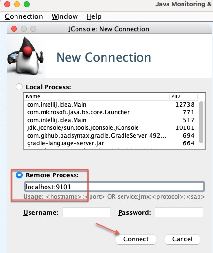
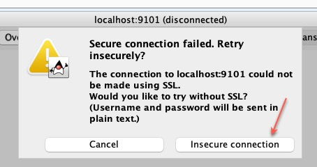
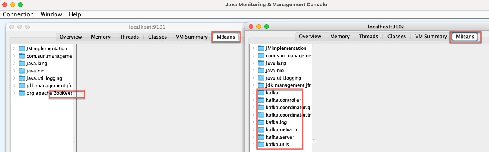

Что запущено?
```shell
podman container ps -a
```

Запуск контейнера
```shell
podman-compose -f kafka-with-jmx.yml up
```

Запуск jconsole
```shell
jconsole 
```
указываем 
 - Zookeeper - localhost:9101
 - Kafka Broker - localhost:9102







Остановка контейнера
```shell
podman-compose -f kafka-with-jmx.yml down
```

--------

