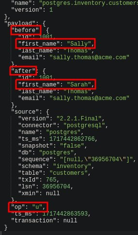

PostgreSQL CDC

Проверяем чего есть
```shell
docker compose ps -a
```

Запускаем Kafka и Kafka Connect
```shell
docker compose up -d
```

Проверям логи Kafka Connect(выйти ^C)
```shell
docker logs -f connect
```

Проверяем статус Kafka Connect
```shell
curl http://localhost:8083 | jq
```

Проверяем плагины коннекторов
```shell
curl http://localhost:8083/connector-plugins | jq
```

Подключаемся к базе и проверяем таблицы
```shell
docker exec -ti -e PGOPTIONS="--search_path=inventory" postgres psql -U postgres
\d
\q
```

Подключаемся к базе и проверяем таблицу.
Образ от Debezium уже имеет настройки и объекты.
```shell
docker exec -ti -e PGOPTIONS="--search_path=inventory" postgres psql -U postgres
SELECT * FROM customers;
\q
```

Создаём коннектор "inventory-connector"
```shell
cat ./inventory.json
```
```shell
curl -X POST --data-binary "@inventory.json" -H "Content-Type: application/json" http://localhost:8083/connectors | jq
```

Проверяем какие коннекторы есть
```shell
curl http://localhost:8083/connectors | jq
```

Проверяем коннектор "inventory-connector"
```shell
curl http://localhost:8083/connectors/inventory-connector/status | jq
```

Смотрим топики
Видим топики postgres.inventory.*
```shell
docker exec kafka1 kafka-topics --list --bootstrap-server kafka1:19092,kafka2:19093,kafka3:19094
```
Сообщения.

Примеры видим в папке "cdc-message-example".
1) структуру состояний "before", "after"
2) payload, тип операции + столбец

Смотрим в UI сообщения
1) [Kafka-ui Link](http://localhost:8081/)
2) [AKHQ UI Link](http://localhost:8080/)

Читаем топик "postgres.inventory.customers"
```shell
docker exec kafka1 kafka-console-consumer --topic postgres.inventory.customers --bootstrap-server kafka1:19092,kafka2:19093,kafka3:19094 --from-beginning --property print.offset=true
```

Обновляем запись в таблице
```shell
docker exec -ti -e PGOPTIONS="--search_path=inventory" postgres psql -U postgres
UPDATE customers SET first_name = 'Sarah' WHERE id = 1001;
SELECT * FROM customers;
\q
```

Видим новое сообщение в топике



Удаляем коннектор
```shell
curl -X DELETE http://localhost:8083/connectors/inventory-connector
```

```shell
curl http://localhost:8083/connectors | jq
```

Останавливаем Kafka и Kafka Connect
```shell
docker compose stop
docker container prune -f
docker volume prune -f
```