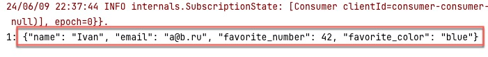

Avro schema  
[user.avsc](avro%2Fuser.avsc)

Перегенерить можно 
1) явно через task **other.customAvroCodeGeneration** (создали таск) [build.gradle.kts](..%2F..%2Fbuild.gradle.kts)
2) не явно **через build**(добавили зависимость) [build.gradle.kts](..%2F..%2Fbuild.gradle.kts)

Результат генерации в  
[User.java](java%2Forg%2Fgulash%2Fkfk%2Fmodel%2FUser.java)

Много настроек  
[build.gradle.kts](..%2F..%2Fbuild.gradle.kts)

**На ARM процессорах хреново работает!**

Запускаем контейнеры и код из Producer-а  
[README.md](..%2F..%2F..%2Fkafka-schema-registry-producer%2Fsrc%2Fmain%2FREADME.md)

Запускаем Consumer-а  
[Main.kt](kotlin%2FMain.kt)

Видим сообщение  

