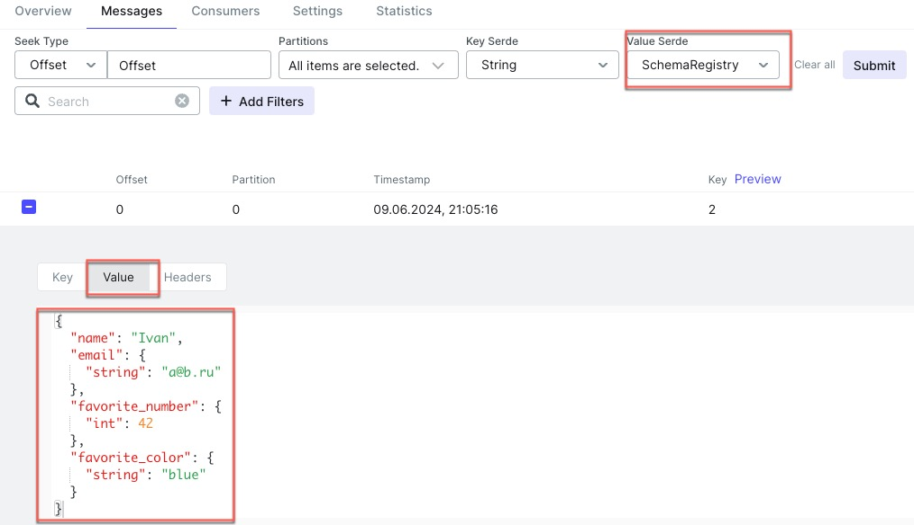

Avro schema <br>
[user.avsc](avro%2Fuser.avsc)

Перегенерить можно 
1) явно через task **other.customAvroCodeGeneration** (создали таск) [build.gradle.kts](..%2F..%2Fbuild.gradle.kts)
2) не явно **через build**(добавили зависимость) [build.gradle.kts](..%2F..%2Fbuild.gradle.kts)

Результат генерации в <br>
[User.java](java%2Forg%2Fgulash%2Fkfk%2Fmodel%2FUser.java)

Много настроек <br>
[build.gradle.kts](..%2F..%2Fbuild.gradle.kts)

Запускаем контейнеры <br>
**На ARM процессорах хреново работает!**

Docker 
1) [kafka-schema-registry_ui.md](..%2F..%2F..%2Fdocker%2Fkafka%2Fyamls%2Fwork%2Fkafka-schema-registry_ui.md)
2) [kafka-schema-registry_ui.yml](..%2F..%2F..%2Fdocker%2Fkafka%2Fyamls%2Fwork%2Fkafka-schema-registry_ui.yml)

Podman
1) [kafka-schema-registry_ui_podman.md](..%2F..%2F..%2Fdocker%2Fkafka%2Fyamls%2Fwork%2Fkafka-schema-registry_ui_podman.md)
2) [kafka-schema-registry_ui_podman.yml](..%2F..%2F..%2Fdocker%2Fkafka%2Fyamls%2Fwork%2Fkafka-schema-registry_ui_podman.yml)

Запускаем продюсера <br>
[Main.kt](kotlin%2FMain.kt)

Видим сообщение <br>


Смотрим какие схемы лежат в Schema registry <br>
```shell
curl --request GET --url 'http://localhost:8081/subjects'
```
Больше информации см. [kafka-schema-registry_ui.rest](..%2F..%2F..%2Fdocker%2Fkafka%2Fyamls%2Fwork%2Fkafka-schema-registry_ui.rest)